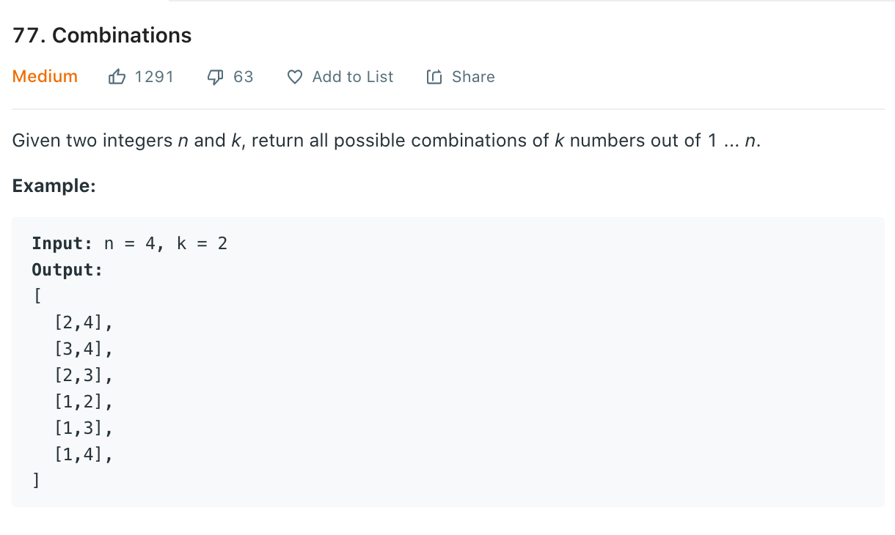

# 100 Days Of LeetCode - Swft

### This is my attempt at 100 days of LeetCode
### Start Date: March 19th, 2020

### Log:
- - - -  

#### These are backlogged, I already submitted them but didn't record when I finished so I am adding them after the fact. 

<!---->

<b>Day 0</b>

1. [1_two_sum](https://github.com/wongandydev/DaysOfSwiftLeetCode/blob/master/Algorithms/1_two_sum.swift)

<!---->

<b>Day 0</b>

1. [2_add_two_numbers](https://github.com/wongandydev/DaysOfSwiftLeetCode/blob/master/Algorithms/2_add_two_numbers.swift)

<!---->

#### Starting here all the solutions are recorded the day I finished them.

<!---->

<b>Day 49</b>

1. [83_remove_duplicates_from_sorted_list](https://github.com/wongandydev/DaysOfSwiftLeetCode/blob/master/Algorithms/83_remove_duplicates_from_sorted_list.swift)

<!---->

<b>Day 50</b>

1. [100_same_tree](https://github.com/wongandydev/DaysOfSwiftLeetCode/blob/master/Algorithms/100_same_tree.swift)

<!---->

<b>Day 50</b>

1. [88_merge_sorted_array](https://github.com/wongandydev/DaysOfSwiftLeetCode/blob/master/Algorithms/88_merge_sorted_array.swift)

<!---->

<b>Day 50</b>

1. [61_rotate_list](https://github.com/wongandydev/DaysOfSwiftLeetCode/blob/master/Algorithms/61_rotate_list.swift)

<!---->

<b>Day 51</b>

1. [107_binary_tree_level_order_traversal_II](https://github.com/wongandydev/DaysOfSwiftLeetCode/blob/master/Algorithms/107_binary_tree_level_order_traversal_II.swift)

<!---->

<b>Day 51</b>

1. [75_sort_colors](https://github.com/wongandydev/DaysOfSwiftLeetCode/blob/master/Algorithms/75_sort_colors.swift)

<!---->

<b>Day 52</b>

1. [101_symmetric_tree](https://github.com/wongandydev/DaysOfSwiftLeetCode/blob/master/Algorithms/101_symmetric_tree.swift)

<!---->

<b>Day 52</b>

1. [77_combinations](https://github.com/wongandydev/DaysOfSwiftLeetCode/blob/master/Algorithms/77_combinations.swift)

